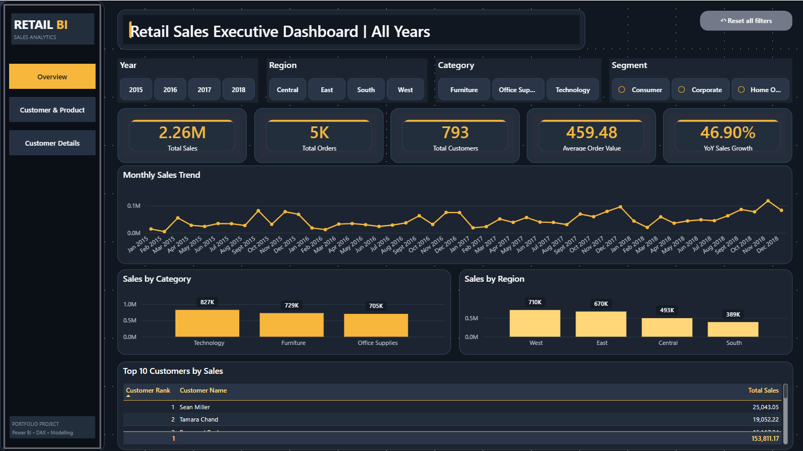
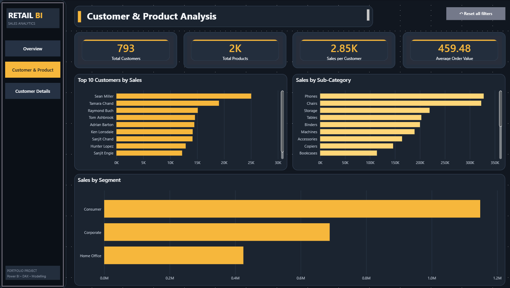
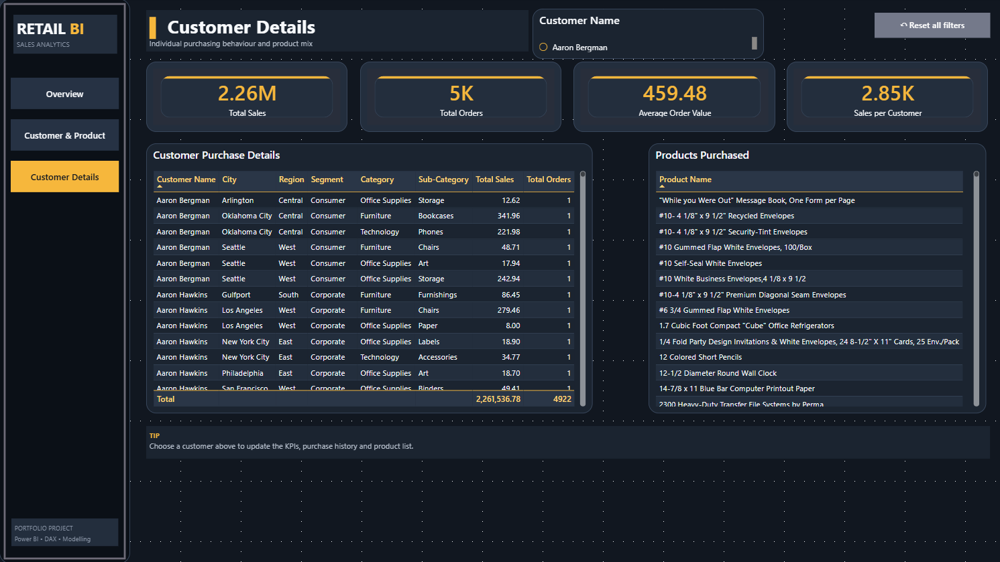

# Retail Sales Analytics | PostgreSQL, SQL & Power BI

## Overview

This project is an end-to-end retail sales analytics portfolio project built using **PostgreSQL, SQL, Power BI, Power Query and DAX**.

The same retail sales dataset was analysed in two complementary ways:

```text
   CSV Dataset
     ↓
PostgreSQL
     ↓
sales table
     ↓
powerbi_sales view
     ↓
Power Query / Sales Data
     ↓
Power BI Model + DAX
     ↓
Interactive Dashboard
```

The PostgreSQL workflow focuses on data-quality validation, business analysis, advanced SQL techniques, customer segmentation and reusable database objects. The Power BI workflow focuses on interactive reporting, DAX measures, data modelling, drill-through analysis and dashboard storytelling.

> **Note:** The Power BI report is sourced directly from PostgreSQL using the public.powerbi_sales view in Import mode.

---

## Business Problem

Management needs a clear view of retail sales performance to understand:

- How sales change over time
- Which regions, states, categories and products generate the most revenue
- Which customer segments contribute the most sales
- Who the highest-value and most frequent customers are
- Whether sales show seasonal patterns
- How order values are distributed
- How shipping performance differs by shipping method
- Which customers may be valuable retention targets
- What individual customers are purchasing
- How business users can explore these findings interactively

---

## Project Objectives

The project was designed to demonstrate practical analytics skills across both SQL and business intelligence tools.

### PostgreSQL / SQL objectives

- Import and structure a 9,800-row retail sales dataset
- Validate data quality before analysis
- Calculate business KPIs and trends
- Analyse product, customer, geographic and shipping performance
- Use CTEs, window functions, ranking, segmentation and percentile analysis
- Build an RFM customer segmentation model
- Create and validate a reusable order-level SQL view

### Power BI objectives

- Build an interactive multi-page dashboard
- Create reusable DAX measures
- Develop a dedicated date model for time intelligence
- Allow users to filter, drill through and investigate customer-level behaviour
- Communicate findings through clear business visuals

---

## Dataset

The dataset contains **9,800 sales transaction rows** covering customers, products, regions, categories, shipping methods and sales over multiple years.

### Core dataset metrics

| Metric | Value |
|---|---:|
| Transaction rows | 9,800 |
| Unique orders | 4,922 |
| Unique customers | 793 |
| Unique products | 1,861 |
| Total sales | $2,261,536.97 |
| Order date range | 2015-01-03 to 2018-12-30 |

**Dataset source:** [Kaggle — Sales Forecasting Dataset](https://www.kaggle.com/datasets/rohitsahoo/sales-forecasting)

---

# PostgreSQL & SQL Analysis

## 1. Data Quality Audit

Before performing business analysis, the dataset was validated for missing values, duplicate row IDs, invalid shipping dates and non-positive sales values.

Key checks included:

- Missing order IDs
- Missing order dates
- Missing ship dates
- Missing customer IDs
- Missing product IDs
- Missing sales values
- Missing postal codes
- Duplicate row IDs
- Ship dates earlier than order dates
- Zero or negative sales values
- Dataset date boundaries

### Audit result

- No missing critical IDs, dates or sales values
- 11 missing postal codes
- No duplicate `row_id` values
- No records shipped before the order date
- No zero or negative sales values

---

## 2. Core Business KPIs

SQL was used to calculate baseline business metrics including:

- Total sales
- Total orders
- Total customers
- Total products
- Average line sale
- Average order value
- Median order value

A separate order-level analysis showed:

- **Average order value:** $459.48
- **Median order value:** $151.88
- **Smallest order:** $0.56
- **Largest order:** $23,661.24

The large difference between the average and median indicates that order values are highly skewed and that a relatively small number of high-value orders pull the average upward.

---

## 3. Product Performance

### Category performance

| Category | Total Sales |
|---|---:|
| Technology | $827,455.94 |
| Furniture | $728,658.75 |
| Office Supplies | $705,422.28 |

**Technology was the highest-revenue product category.**

### Sub-category highlights

- Phones generated approximately **$327.8K**
- Chairs generated approximately **$322.8K**
- Copiers and Machines had very high average line-sale values despite relatively low order frequency
- Office Supplies products appeared frequently in orders but generally had lower individual transaction values

The analysis showed a clear distinction between **high-value products** and **high-frequency products**.

---

## 4. Geographic Performance

### Regional sales contribution

| Region | Total Sales | Share of Total Sales |
|---|---:|---:|
| West | $710,219.77 | 31.40% |
| East | $669,518.85 | 29.60% |
| Central | $492,646.90 | 21.78% |
| South | $389,151.45 | 17.21% |

The **West** was the strongest region and the **East** was a close second. Together, they generated approximately **61% of total sales**.

### Top state in each region

| Region | Top State | Sales |
|---|---|---:|
| Central | Texas | $168,572.47 |
| East | New York | $306,361.07 |
| South | Florida | $88,436.55 |
| West | California | $446,306.49 |

California was the strongest individual state by a wide margin.

---

## 5. Sales Trends & Seasonality

### Yearly sales

| Year | Sales | YoY Growth |
|---|---:|---:|
| 2015 | $479,856.27 | — |
| 2016 | $459,435.94 | -4.26% |
| 2017 | $600,192.80 | +30.64% |
| 2018 | $722,051.96 | +20.30% |

Sales declined slightly in 2016 before rebounding strongly in 2017 and continuing to grow in 2018.

### Seasonal pattern

Sales were consistently stronger toward the end of the year.

- **November:** approximately $350K across all years
- **December:** approximately $321K
- **September:** approximately $300K
- **February:** the weakest month overall

This suggests a clear **September–December peak sales period**.

---

## 6. Customer Analysis

SQL was used to compare:

- Highest-value customers
- Most frequent customers
- Customer segments
- Revenue concentration
- Customer-level average order value

### Highest-value customer

**Sean Miller** generated approximately **$25.0K** in sales from five orders.

The analysis showed that the most valuable customers were not always the most frequent customers. Some customers generated high revenue through a relatively small number of large orders.

### Revenue concentration

The top 10 customers generated:

- **$153,811.22**
- **6.80% of total sales**

This suggests that revenue is relatively well distributed across the broader customer base rather than being heavily dependent on only a handful of customers.

---

## 7. Customer Segment Performance

| Segment | Total Sales | Total Orders |
|---|---:|---:|
| Consumer | $1,148,060.51 | 2,537 |
| Corporate | $688,494.14 | 1,491 |
| Home Office | $424,982.32 | 894 |

The **Consumer** segment generated the highest total sales and order volume.

Home Office generated the lowest total revenue but had the highest average order value among the three customer segments.

---

## 8. Shipping Performance

An order-level CTE was used to ensure each order was counted once when calculating shipping performance.

| Ship Mode | Orders | Avg. Shipping Days |
|---|---:|---:|
| Same Day | 261 | 0.05 |
| First Class | 772 | 2.19 |
| Second Class | 944 | 3.24 |
| Standard Class | 2,945 | 5.00 |

Standard Class was the most common shipping method and averaged approximately five days from order to shipment.

---

## 9. Order Value Distribution

Orders were grouped into value bands using a SQL `CASE` statement.

Key findings:

- About **42% of orders were under $100**
- Orders between **$1,000 and $4,999** represented a much smaller share of orders but contributed a large proportion of revenue
- Only **27 orders** exceeded $5,000, yet these high-value orders contributed disproportionately to total sales

This reinforced the gap between the average and median order values.

---

## 10. RFM Customer Segmentation

An RFM model was created using:

- **Recency** — days since the customer's most recent purchase
- **Frequency** — number of unique orders
- **Monetary value** — total customer spending

`NTILE(5)` window functions were used to score customers from 1 to 5 and classify them into business-friendly segments.

### RFM segments

| Segment | Customers | Total Sales | Avg. Customer Value |
|---|---:|---:|---:|
| Champions | 105 | $551,799.44 | $5,255.23 |
| At Risk | 139 | $467,384.83 | $3,362.48 |
| Regular Customers | 297 | $493,960.51 | $1,663.17 |
| Loyal Customers | 133 | $386,786.64 | $2,908.17 |
| Big Spenders | 39 | $224,078.88 | $5,745.59 |
| New / Promising | 80 | $137,525.67 | $1,719.07 |

### RFM interpretation

- **Champions** generated the most revenue as a segment
- **At Risk** customers represented a substantial amount of existing customer value
- **Big Spenders** had the highest average customer value
- The At Risk segment represents a clear potential retention opportunity

---

## 11. Reusable SQL View

A reusable `order_summary` view was created to transform transaction-level data into one row per order.

The view includes:

- Order ID
- Customer details
- Segment
- Region
- Order date
- Ship date
- Shipping method
- Line-item count
- Total order value
- Shipping days

The view was validated against the original dataset:

| Validation Metric | Result |
|---|---:|
| Orders | 4,922 |
| Sales | $2,261,536.97 |

This confirmed that the order-level view reconciles back to the original transaction data.

---

## SQL Techniques Demonstrated

This project uses:

- `SELECT`
- `WHERE`
- `GROUP BY`
- `ORDER BY`
- `HAVING`
- `COUNT`
- `SUM`
- `AVG`
- `MIN`
- `MAX`
- `DISTINCT`
- `FILTER`
- `CASE`
- `EXTRACT`
- `TO_CHAR`
- Common Table Expressions (`WITH`)
- Window functions
- `LAG()`
- `RANK()`
- `PARTITION BY`
- `NTILE()`
- `PERCENTILE_CONT()`
- Subqueries
- Reusable SQL views
- Data-quality validation
- Order-level aggregation
- RFM segmentation

The full analysis is available in:

```text
sql/retail_sales_analysis.sql
```

---

# Power BI Dashboard

The Power BI report contains three interactive pages.

## 1. Executive Dashboard

Provides a high-level view of business performance, including:

- Total Sales
- Total Orders
- Total Customers
- Average Order Value
- Year-over-Year Sales Growth
- Monthly Sales Trend
- Sales by Category
- Sales by Region
- Top 10 Customers by Sales
- Interactive Year, Region, Category and Segment filters



---

## 2. Customer & Product Analysis

Provides deeper analysis of:

- Total Customers
- Total Products
- Sales per Customer
- Average Order Value
- Top 10 Customers by Sales
- Sales by Sub-Category
- Sales by Customer Segment



---

## 3. Customer Details

Allows users to investigate individual customer purchasing behaviour using:

- Customer selection
- Customer-level KPI cards
- Customer purchase history
- Product purchase details
- Drill-through navigation



---

## Power BI Data Model

The report uses a dedicated Date table connected to the sales transaction table.

```text
Date
  1
  |
  *
Sales Data
```

This supports time-intelligence calculations and chronological reporting.

---

## Key DAX Measures

### Total Sales

```DAX
Total Sales =
SUM('Sales Data'[Sales])
```

### Total Orders

```DAX
Total Orders =
DISTINCTCOUNT('Sales Data'[Order ID])
```

### Total Customers

```DAX
Total Customers =
DISTINCTCOUNT('Sales Data'[Customer ID])
```

### Total Products

```DAX
Total Products =
DISTINCTCOUNT('Sales Data'[Product ID])
```

### Average Order Value

```DAX
Average Order Value =
DIVIDE(
    [Total Sales],
    [Total Orders]
)
```

### Sales per Customer

```DAX
Sales per Customer =
DIVIDE(
    [Total Sales],
    [Total Customers]
)
```

### Customer Rank

```DAX
Customer Rank =
RANKX(
    ALLSELECTED('Sales Data'[Customer Name]),
    [Total Sales],
    ,
    DESC,
    DENSE
)
```

### Year-over-Year Sales Growth

```DAX
YoY Sales Growth =
VAR CurrentSales =
    [Total Sales]

VAR PreviousSales =
    CALCULATE(
        [Total Sales],
        DATEADD('Date'[Date], -1, YEAR)
    )

RETURN
    DIVIDE(
        CurrentSales - PreviousSales,
        PreviousSales
    )
```

---

## Interactive Power BI Features

- Year, Region, Category and Segment slicers
- Cross-filtering between visuals
- Page navigation
- Active-page navigation highlighting
- Reset-filter controls
- Customer drill-through
- Customer-level filtering
- Dynamic KPI calculations
- Top-N customer analysis

---

# Key Business Findings

1. **Technology was the highest-performing product category**, generating approximately **$827K in sales**.

2. **The West was the strongest-performing region**, generating approximately **$710K**, or **31.4% of total sales**. The South generated approximately **$389K (17.2%)**, meaning West sales were about **82.5% higher than South sales**.

3. **Consumer customers were the largest customer segment**, generating approximately **$1.15M in sales**.

4. **Sean Miller was the highest-value customer**, generating approximately **$25.0K** in sales. This was about **31% higher than Tamara Chand**, the second-highest customer at approximately **$19.1K**.

5. **Sales showed clear seasonality**, with performance strengthening from **September through December** and November producing the highest cumulative monthly revenue.

6. **Order values were highly skewed**: average order value was **$459.48**, while median order value was only **$151.88**.

7. **The top 10 customers contributed only 6.8% of total sales**, suggesting revenue is broadly distributed across the customer base.

8. **RFM segmentation identified a valuable At Risk segment**, with 139 customers representing approximately **$467K in historical sales**.

---

# Business Recommendations

Based on the analysis:

- **Prepare for Q4 demand:** inventory, staffing and promotional planning should account for the strong September–December sales pattern.
- **Protect Technology revenue:** Technology is the strongest category across all four regions and should remain a key product focus.
- **Target At Risk customers:** customers with strong historical value but low recency may be good candidates for retention or re-engagement campaigns.
- **Monitor high-value orders:** a small number of large orders contribute disproportionately to revenue, so high-value purchasing behaviour should be monitored separately from everyday order volume.
- **Investigate weaker regions:** the gap between the West and South suggests an opportunity to examine differences in customer mix, product demand or market coverage.

---

# Tools Used

- **PostgreSQL** — relational database and SQL analysis
- **pgAdmin 4** — database administration and query execution
- **SQL** — data validation, aggregation, CTEs, window functions, segmentation and views
- **Power BI Desktop** — interactive report development
- **Power Query** — data preparation and type validation
- **DAX** — KPI measures, ranking and time intelligence
- **GitHub** — project documentation and portfolio presentation

---

# Repository Structure

```text
Retail-Sales-Analytics/
│
├── README.md
├── Retail_Sales_Analytics_Dashboard.pbix
├── .gitignore
│
├── sql/
│   └── retail_sales_analysis.sql
│
├── screenshots/
│   ├── 01-executive-dashboard.png
│   ├── 02-customer-product-analysis.png
│   └── 03-customer-details.png
│
├── insights/
│   └── business-insights.md
│
└── docs/
    └── dax-measures.md
```

---

# How to View the Project

## Power BI

1. Download `Retail_Sales_Analytics_Dashboard.pbix`.
2. Open it in Microsoft Power BI Desktop.
3. Use the page navigation to move between report pages.
4. Use slicers and visual interactions to explore sales performance.
5. Use Customer Details / drill-through to investigate individual customers.

## SQL

1. Open `sql/retail_sales_analysis.sql`.
2. Run the script against a PostgreSQL database containing the retail sales dataset.
3. Review the organised analysis sections covering data quality, KPIs, products, customers, geography, trends, shipping, RFM segmentation and views.


### Data Refresh 

The Power BI report uses PostgreSQL as its data source through the `public.powerbi_sales` view.

The PBIX contains imported data and can be opened and explored without a live database connection. To refresh the dataset, PostgreSQL must be running and the `retail_sales_analysis` database and `powerbi_sales` view must be available.

---

# Skills Demonstrated

`PostgreSQL` · `SQL` · `CTEs` · `Window Functions` · `RFM Segmentation` · `Data Quality` · `Business Analysis` · `Power BI` · `DAX` · `Power Query` · `Data Modelling` · `Time Intelligence` · `Data Visualisation` · `Dashboard Design` · `Business Storytelling`

---

# Author

**Isaac Paradesh**

- LinkedIn: [linkedin.com/in/isaac-paradesh-567706281](https://www.linkedin.com/in/isaac-paradesh-567706281)
- GitHub: [github.com/isaac-paradesh](https://github.com/isaac-paradesh)
